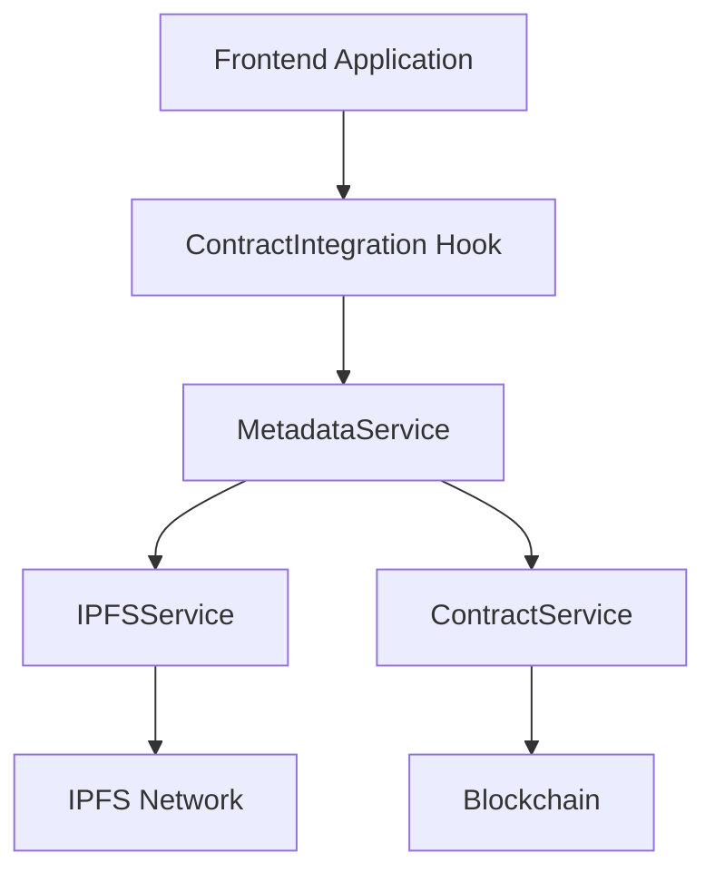

# Contract Integration Documentation

## Overview

The `@loanchain/contract-integration` package provides robust integration with blockchain smart contracts for the LoanChain platform. This package bridges the gap between our frontend application and the blockchain by providing:

1. Smart contract interaction services
2. Metadata handling and IPFS storage integration
3. Network configuration for different blockchains
4. Gas fee estimation and transaction management

## Architecture

The package follows a service-oriented architecture with the following key components:



## Components

### Contract Service

The `ContractService` is responsible for direct interaction with the LoanToken smart contract on the blockchain. It provides methods for:

- Minting loan tokens
- Getting loan metadata
- Checking user roles
- Fetching active loans
- Getting loans by owner

#### Example Usage

```typescript
const contractService = new ContractService({
  loanRegistryAddress: "0x1234567890123456789012345678901234567890",
  chainId: ChainId.MOONBASE_ALPHA,
});

// Mint a loan token
const result = await contractService.mintLoanToken(
  userWalletAddress,
  "ipfs://Qm123456789",
  loanData,
);
```

### Metadata Service

The `MetadataService` combines IPFS storage with contract operations, providing a high-level API for:

- Uploading metadata to IPFS and minting tokens in a single operation
- Constructing proper metadata from loan data
- Estimating gas fees
- Managing user loans

#### Example Usage

```typescript
const metadataService = new MetadataService({
  ipfsGateway: "https://gateway.pinata.cloud",
  pinataApiKey: process.env.PINATA_API_KEY,
  pinataSecretKey: process.env.PINATA_SECRET_KEY,
  contractService,
});

// Upload metadata and mint token in one step
const mintResult = await metadataService.uploadAndMint(
  userWalletAddress,
  enhancedLoanData,
);
```

### Network Configuration

The package provides configuration for different networks, including:

- Moonbase Alpha TestNet
- Moonbeam MainNet
- Moonriver
- Development network

Each network configuration includes RPC URLs, block explorers, and contract addresses.

## Frontend Integration

The package includes a React hook for easy integration with the frontend:

```typescript
const {
  metadataService,
  isLoading,
  error,
  checkMinterRole,
  estimateGasFee,
  walletAddress,
} = useContractIntegration();
```

This hook automatically handles:

- Network switching
- Service initialization
- Error handling
- Permission checking

## Testing

The package includes comprehensive tests for both services, with mocked blockchain and IPFS interactions for reliable testing.

## Future Improvements

1. **Gas Optimization**: Implement more accurate gas estimation based on network conditions
2. **Transaction History**: Add local storage for transaction history tracking
3. **Multi-chain Support**: Expand support to additional EVM-compatible chains
4. **Event Subscriptions**: Implement event subscriptions for real-time updates
5. **Batch Operations**: Add support for batch minting and operations

## Deployment

When deploying to a production environment, make sure to:

1. Update the contract addresses in the configuration for the target network
2. Set up proper environment variables for IPFS API keys
3. Configure the network in the frontend to match the deployment target
4. Test thoroughly on the target network before going live
